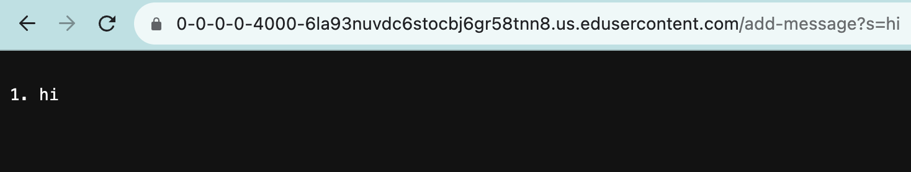
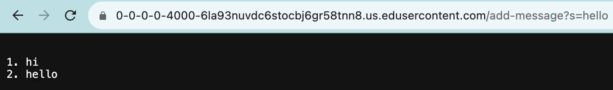
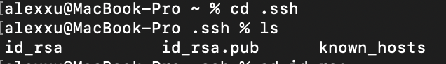
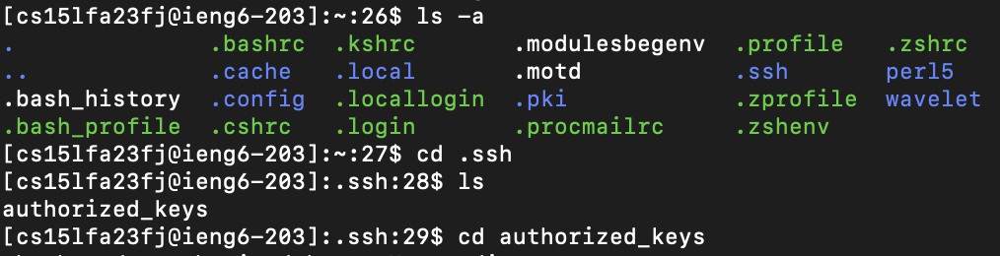
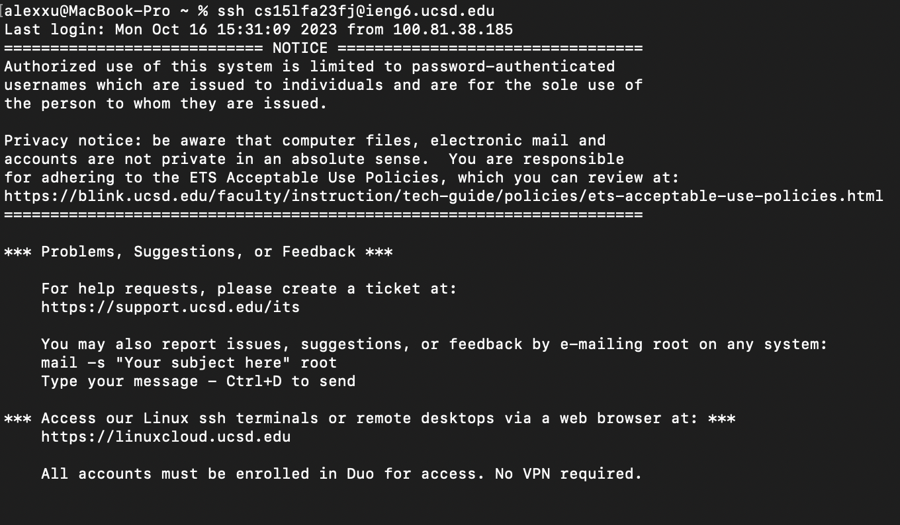

# Lab Report 2 - VSCode and Your Local Machine (Week 3)
## Part 1

```
import java.io.IOException;
import java.net.URI;
import java.util.ArrayList;

class Handler implements URLHandler {
    // The one bit of state on the server: a number that will be manipulated by
    // various requests.
   ArrayList<String> list = new ArrayList<String>();

    public String handleRequest(URI url) {
        if (url.getPath().equals("/")) {
            String result = "";
            for(String s: list) result+=s;
            return result;
        }else if (url.getPath().contains("/add-message")) {
            String[] parameters = url.getQuery().split("=");
            if (parameters[0].equals("s")) {
            list.add( "\n" + (list.size() + 1) + ". " + parameters[1]);
             String result = "";
            for(String s: list) result+=s;
            return result;
            } 
        }else {
            if (url.getPath().contains("/search")) {
                String[] parameters = url.getQuery().split("=");
                if (parameters[0].equals("s")) {
                ArrayList<String> result = new ArrayList<String>();
                for(String s: list){
                    if(s.contains(parameters[1])) result.add(s);
                }       
                    return result.toString();
                }
            }
        }
        return "404 Not Found!";
    }
}
class StringServer {
    public static void main(String[] args) throws IOException {
        if(args.length == 0){
            System.out.println("Missing port number! Try any number between 1024 to 49151");
            return;
        }

        int port = Integer.parseInt(args[0]);

        Server.start(port, new Handler());
    }
}
```

 <br>

The handleRequest method is called to add the String "hi" to the output string. The handleRequest method takes the URL and gets its path. Before the method was called, the ArrayList `list` that stores the final output string was empty.
With this request, `/add-message` concatenates a `\n` line break, then the number of the added String on the list, and then the actual String "hi" onto `list`. As a result, the length of `list` increases by one and has "\n1.hi" in it.

 <br>
The handleRequest method is called to add the String "hello" to the output string. The handleRequest method takes the URL and gets its path. Before the method was called, the ArrayList `list` that stores the final output string had 
one string in it, "\n1.hi". With this request, `/add-message` concatenates a `\n` line break, then the number of the added String on the list, and then the actual String "hello" onto `list`. As a result, the length of `list` increases
by one and has "\n1. hi\n2. hello" in it.

## Part 2
Path to private key on my computer:
 <br>

Path to public key on ieng6: <br>
 <br>

Logging into ieng6 without password: <br>
 <br>

## Part 3

I learned in lab how to log into a remote computer, which I had never done before. I also had no idea that my own computer could generate its own public and private key pairs, so doing that was cool. 
