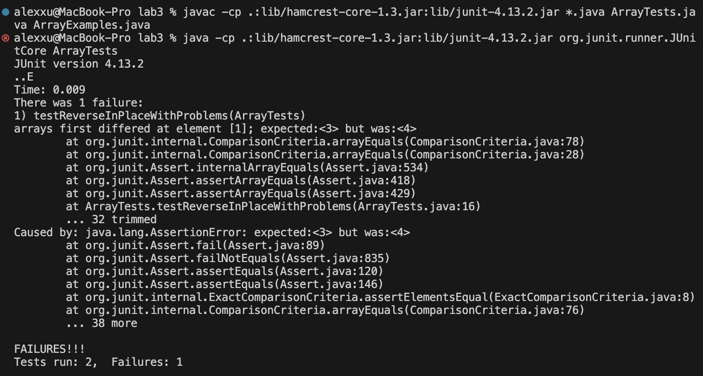

# Lab Report 3 - - Bugs and Commands (Week 5)
## Part 1
Failure inducing output for `reverseInPlace`:
```
public void testReverseInPlace() {
    int[] input1 = { 3, 4 };
    ArrayExamples.reverseInPlace(input1);
    assertArrayEquals(new int[]{ 4, 3 }, input1);
	}
```
An input that doesn't induce failure for `reverseInPlace`:
```
public void testReverseInPlace() {
    int[] input1 = { 3 };
    ArrayExamples.reverseInPlace(input1);
    assertArrayEquals(new int[]{ 3 }, input1);
	}
```
The symptom, as the output of running the tests: <br>
 <br>

The buggy code, before fixing:
```
static void reverseInPlace(int[] arr) {
    for(int i = 0; i < arr.length; i += 1) {
      arr[i] = arr[arr.length - i - 1];
    }
  }
```
The buggy code, after fixing:
```
static void reverseInPlace(int[] arr) {
    for(int i = 0; i < arr.length/2; i += 1) {
      int temp = arr[i];
      arr[i] = arr[arr.length - i - 1];
      arr[arr.length - i - 1] = temp;
    }
  }
```
The fix prevents any integers in the array from being lost when the original integer at a certain index is replaced by the reversed index integer. It does this by storing the original index integer in a temp variable, then referring to that temp variable when replacing the reversed index integer.
## Part 2 - `grep`
All options found on https://www.freecodecamp.org/news/grep-command-in-linux-usage-options-and-syntax-examples/#:~:text=Grep%20is%20a%20useful%20command,a%20powerful%20command%20to%20use. <br>
### `-i`
```
alexxu@MacBook-Pro docsearch % grep -i  "Alcohol" technical/government/Alcohol_Problems/Session2-PDF.txt
Identifying ED Patients with Alcohol Problems
Many patients in the emergency department (ED) have alcohol
further examine and refine alcohol-screening questionnaires in the
Alcohol problems defined
Alcohol problems designate a spectrum from risk behavior to
illness, and from problematic consumption to alcohol use disorder.
screening for several alcohol endpoints. Acute intoxication is of
certainly be considered an "alcohol problem." The blood or breath
alcohol concentration (BAC), coupled with our clinical
observations, may help us identify intoxication. Most alcohol
screening tests identify patients with alcohol use disorders or
problematic consumption of alcohol. The American Psychiatric
(ICD-9, -10) have rigorously defined alcohol abuse and alcohol
cases of alcohol abuse meet the ICD-10 definition. In general, an
alcohol use disorder is present when an aspect of the patient's
by alcohol. Before function is compromised, problematic
toward identifying patients with high alcohol consumption before
Institute on Alcohol Abuse and Alcoholism (NIAAA) defines at-risk
the alcohol use spectrum. However, real tests don't perform
would address both current and lifetime alcohol problems. Current
identifying alcohol use disorders or problematic consumption.7 Of
course, BAC can help identify acute intoxication. The alcohol
diagnosis, but clinical impressions concerning alcohol problems can
be inaccurate. Trained practitioners counseling alcoholics could
patients with alcohol problems. Unfortunately, the majority of
reported that in a trauma center ED, staff suspected alcohol-ism in
a sensitivity of 29% for alcohol problems in the ED.7
Self-report may be enhanced when specific alcohol questions are
to detect alcohol use disorders. The CAGE was developed in 1968 as
a brief screening tool for primary care providers to detect alcohol
The MAST (Michigan Alcohol-Screening Test), developed in 1971 as
a screen for alcohol abuse and dependence, has 24 yes/no questions.
SAAST (Self-Administered Alcoholism Screening Test) was
developed in 1972 to screen for alcohol abuse and dependence. It
drinkers. WHO developed the AUDIT (Alcohol Use Disorder
at-risk drinking in addition to alcohol abuse and dependence. AUDIT
about even lower levels of alcohol consumption in this group has
screens for alcohol abuse and dependence. It has five questions,
minutes to administer.33 T-ACE also screens for alcohol abuse and
at-risk drinking, alcohol abuse, and dependence. It is a
Rapid Alcohol Assessment Screen (RAPS4). Cherpitel screened an ED
alcohol?"- followed by three questions about alcohol consumption
an ICD-10 diagnosis of alcohol dependence.7 In the second study,
with an ICD-10 or DSM-IV diagnosis of alcohol dependence, harmful
84%, for a DSM-IV diagnosis of alcohol dependence.37 Fiellin
reviewed 38 studies of screening for alcohol use disorder in the
For alcohol abuse or dependence, CAGE was found most effective with
best within the spectrum of alcohol use they were developed to
were the best tests for alcohol dependence among women. Their
sensitivities (59% and 48% respectively) for alcohol dependence
Alcohol concentration
identify intoxication. The presence of alcohol may not always
indicate an alcohol problem. While a very high BAC in an unimpaired
insensitive screen for an alcohol use disorder. One study found
that only one-third of intoxicated drivers had an alcohol use
disorder.43 In an ED study, BAC was a poor screen for alcohol abuse
self-reported drinking.7 In another ED study, a saliva alcohol
center, BAC had a sensitivity of 63% for an alcohol disorder.5
with sensitivities of 13% to 67% for alcohol use disorders or
and confronting patients with their blood alcohol levels may
reveal the negative consequences or link alcohol to current
staff does not use structured questionnaires for alcohol screening.
ED staff has no systematic approach to alcohol screening. Staff
rates. EDs have reported high case rates of alcohol problems,
trauma, injuries, assaults,72 depression, and alcohol-related
ED patient care should be improved by implementing alcohol
the lack of counseling available to address patients' alcohol
Most EDs provide very limited alcohol services. When care is
volume of alcohol-involved patients, and the capacity to undertake
4. National Institute on Alcohol Abuse and Alcoholism. The
Physician's Guide to Helping Patients with Alcohol Problems.
the CAGE, the Brief Michigan Alcoholism Screening Test, and the
Alcohol Use Disorders Identification Test in screening trauma
center patients for alcoholism. J Trauma 1997;43:962-9.
6. Gale T, Ja W, Welty T. Differences in detection of alcohol
7. Cherpitel C. Screening for alcohol problems in the emergency
8. Cherpitel C. Comparison of screening instruments for alcohol
regions of the country. Alcohol Clin Exp Res 1997;21:1391-7.
alcohol intoxication and chronic alcohol abuse on outcome from
alcohol problems in the emergency department, part 1: improving
the breath alcohol analyzer. Ann Emerg Med 1984;13:516-20.
12. Gibb K. Serum alcohol levels, toxicology screens, and use
of the breath alcohol analyzer. Ann Emerg Med 1986;15:349-53.
intoxication in alcoholics. J Consult Clin Psychol
Clifford P. Alcohol use among subcritically injured emergency
alcohol-related problems in general practice. J Stud Alcohol
with the Alcohol Use Disorders Identification Test (AUDIT) in an
acute alcohol intoxication and chronic alcohol dependence by trauma
questions in the detection of alcoholism. JAMA 1988;259:51-4.
19. Fleming M, Barry K. The effectiveness of alcoholism
screening in an ambulatory care setting. J Stud Alcohol
20. Fleming M, Barry K. A three-sample test of a masked alcohol
screening questionnaire. Alcohol 1991;26:81-91.
for alcoholism. J Gen Intern Med 1990;5:361-4.
24. Ewing J. Detecting alcoholism: the CAGE questionnaire.
validation of a new alcohol screening instrument. Am J Psychiatry
version of the Michigan Alcoholism Screening Test. Am J Psychiatry
27. Selzer M. The Michigan Alcoholism Screening Test: the quest
Short Michigan Alcoholism Screening Test (SMAST). J Stud Alcohol
analysis of the Self-Administered Alcoholism Screening Test.
Alcohol Clin Exp Res 1987;11:269-73.
30. Davis L, Jr., Morse R. Self-Administered Alcoholism
computer-administered formats. Alcohol Clin Exp Res
31. Saunders J, Aasland O, Amundsen A, Grant M. Alcohol
With Harmful Alcohol Consumption, I. Addiction 1993;88:349-62.
Development of the Alcohol Use Disorders Identification Test
pregnancy risk-drinking. Alcohol Clin Exp Res 1994;18:1156-61.
drinking in the emergency room: the RAPS4. Rapid Alcohol Problems
Screen. J Stud Alcohol 2000;61:447-9.
in an emergency room population. J Stud Alcohol 1998;59:420-6.
the CAGE, the Brief Michigan Alcohol Screening Test, and the
Alcohol Use Disorders Identification Test in screening trauma
center patients for alcoholism. J Trauma 1997; 43:962-9.
38. Fiellin DA, Reid MC, O'Connor PG. Screening for alcohol
screening instruments for identifying harmful drinking and alcohol
dependence in the emergency room. Alcohol Clin Exp Res
instruments for alcohol problems in the emergency room. J Stud
Alcohol 1995;56:695-700.
41. Bradley KA, Boyd-Wickizer J, Powell SH, Burman ML. Alcohol
Alcoholism. Criteria for the diagnosis of alcoholism. Am J
43. Gijbers A, Raymond A, Whelan G, et al. Does a blood alcohol
M. Prevalence and recognition of alcohol abuse in a primary care
alcoholism in primary health care: compared efficacy of different
instruments. Drug Alcohol Depend 1995;40:151-8.
Objective diagnosis of alcohol abuse: compared values of
transferase (GGT), and mean corpuscular volume (MCV). Alcohol Clin
clinic: is this test useful in assessing alcohol consumption?
Alcohol. 1998;33:304-9.
transferrin and conventional alcohol markers as indicators for
Alcohol Clin Exp Res 1998;22:892-6.
A. Screening for excessive alcohol drinking: comparative value of
criterion-oriented validation of an alcoholism questionnaire in
Cigarette, alcohol, and other drug use by school-age pregnant
brief intervention for adolescent alcohol use. Arch Pediatr Adolesc
and the risk of alcohol dependence. Addiction 1993;88:1209-18.
Alcoholism screening in the elderly. J Am Geriatr Soc
62. Bercsi S, Brickner P, Saha D. Alcohol use and abuse in the
Alcohol Depend 1993;33:139-49.
H. Identification of alcoholism and depression in a geriatric
64. Fink A, Hays RD, Moore AA, Beck JC. Alcohol-related
encountered with opportunistic screening for alcohol-related
68. Burke T. The economic impact of alcohol abuse a
```
```
alexxu@MacBook-Pro docsearch % grep -i  "legal" technical/government/About_LSC/Comments_on_semiannual.txt

LEGAL SERVICES CORPORATION BOARD OF DIRECTORS
I am pleased to transmit the comments of the Legal Services
our goal of providing high quality legal assistance to the poor of
Douglas S. Eakeley, Chairman Legal Services Corporation May 31,
State Planning Report from the Legal Services Corporation, issued
of legal services delivered by programs,2 and forged new and deeper
Since 1998, LSC has restructured legal services programs in 24
?? function as a concerted, coherent, closely coordinated legal
?? develop additional resources to expand legal services;
quality legal services;
?? target legal services resources to achieve the greatest
state communities of justice - integrated and coordinated legal
continues to assist recipients in improving the quality of legal
Legal Services Corporation
The Legal Services Corporation is a private, non-profit
corporation established in the District of Columbia by the Legal
provide financial support for legal assistance in civil proceedings
to persons unable to afford legal services. LSC is governed by an
legal services to indigent persons across the country. Of the funds
the effectiveness of the delivery of legal assistance by its
initiative for statewide planning and coordination of legal
maintenance of high quality legal assistance to eligible
legal services programs throughout the nation by improving access
to legal services while enhancing their quality. The Plan
expanding access to, and availability of, civil legal services
legal services delivery system.
resources for civil legal services, new and more efficient ways of
providing legal information and advice to low-income persons, and
the potential for half of the states to provide clients with legal
to Justice Conference; the EJC; the National Legal Aid and Defender
conference of representatives from legal services, state courts,
To assure the provision of high quality legal assistance to
programs provide referrals and community legal education, engage in
?? Referrals; ?? Community legal education presentations; ??
Community legal education materials, articles and web sites; ?? Pro
clients to obtain critical legal services from LSC recipients. The
the legal services community can better empower, strengthen and
enhance the lives of legal services clients. It convened client and
community advocates, as well as legal services staff who embrace
the concept of client-centered legal services.
Sixteen (16) conference papers were written by legal services
advocates facilitate client-centered legal services delivery in
National Legal Aid and Defender Association and the Management
Legal Affairs and the Office of Information Management, with the
legal services. As part of this project, LSC solicited public
```
`-i` makes `grep` ignore capitalization, which is useful for when a search word could be capitalized or not capitalized inside the file.
### `-v`

```
alexxu@MacBook-Pro docsearch % grep -v -i  "a" technical/government/Alcohol_Problems/Session2-PDF.txt
Session 2.

tests
drinks).
subgroups.
or blood test.11,12
sensitivity (40% to 70%).18 Subsequent reports from other
version.26-28
Studies of screening tests
explore.38
on these screening instruments improved sensitivity without loss of
for these subgroups.
the ED.
efficient use.35
in the ED.
in the ED.
protocol.
screening on some of the highest-risk groups or screening with
problems in most EDs.
screening tools in the ED. The sequence of screening tests needs to
References
Press; 1994.
1979;47:205-6.
1992;53:197-202.
1991;52:33-6.
J Med 1995;98:232-6.
1998;46:328-35.
1974;131:1121-3.
1972;129:342-8.
1971;127:1653-8.
1975;36:117-26.
1991;15:155-7.
1989;160:863-70.
2000;160:1977-89.
1995;19:628-34.
Exp Res 2000;24:1414-9.
50. Yersin B, Nicolet J-F, Decrey H, Burner M, Melle G, Pecoud
1996;11:426-30.
1994;15:303-10.
Med 1995;149:1241-8.
1987;35:864-9.
1999;36:33-9.
```
```
alexxu@MacBook-Pro docsearch % grep -v -i  "i" technical/government/Alcohol_Problems/Session2-PDF.txt

Robert Woolard, MD
tests
reflects the performance of a test; the larger the area the better
the alcohol use spectrum. However, real tests don't perform
subgroups.
Payers may pay for some tests and not others. These and other
referral as needed.
or blood test.11,12
Several screens have been developed for pregnant women. Concern
prompted development of the screens TWEAK, T-ACE, and NET. TWEAK
One screen has been developed for emergency department use, the
explore.38
for these subgroups.
to address current problems (the past year or three months) rather
the ED.
computer feedback, need to be explored.
such as women,41 adolescents,54-59 and elders,60-64 needs to be
protocol.
lead naturally to referral and treatment. Others may not promote
References
Acad Emerg Med 1998; 5:781-7.
Press; 1994.
department. Ann Emerg Med 1995;26:158-66.
trauma. JAMA 1993;270:51-6.
the breath alcohol analyzer. Ann Emerg Med 1984;13:516-20.
of the breath alcohol analyzer. Ann Emerg Med 1986;15:349-53.
1979;47:205-6.
1992;53:197-202.
center staff. J Trauma 1999; 47:1131-9.
1991;52:33-6.
J Med 1995;98:232-6.
1998;46:328-35.
JAMA. 1984;252: 1905-7.
1974;131:1121-3.
1972;129:342-8.
1971;127:1653-8.
1975;36:117-26.
1991;15:155-7.
31. Saunders J, Aasland O, Amundsen A, Grant M. Alcohol
32. Saunders J, Aasland O, Babor T, De La Fuente J, Grant M.
1989;160:863-70.
Screen. J Stud Alcohol 2000;61:447-9.
2000;160:1977-89.
1995;19:628-34.
Alcohol 1995;56:695-700.
Acad Emerg Med 1996;3:239-45.
Exp Res 2000;24:1414-9.
Alcohol. 1998;33:304-9.
1996;11:426-30.
Health 1987;36:89-94.
1994;15:303-10.
Med 1995;149:1241-8.
1987;35:864-9.
Alcohol Depend 1993;33:139-49.
1999;36:33-9.
66. Peters J, Brooker C, McCabe C, Short N. Problems
```
`-v` makes `grep` find lines that do not match the search pattern, which is useful for when you know exactly what you're not looking for in a file.

### `-n`

```
alexxu@MacBook-Pro docsearch % grep -n -v -i  "i" technical/government/Alcohol_Problems/Session2-PDF.txt
1:
2:
3:
4:
7:
8:Robert Woolard, MD
56:tests
65:reflects the performance of a test; the larger the area the better
70:the alcohol use spectrum. However, real tests don't perform
87:subgroups.
117:Payers may pay for some tests and not others. These and other
129:referral as needed.
138:or blood test.11,12
194:Several screens have been developed for pregnant women. Concern
196:prompted development of the screens TWEAK, T-ACE, and NET. TWEAK
206:One screen has been developed for emergency department use, the
238:explore.38
267:for these subgroups.
295:to address current problems (the past year or three months) rather
299:the ED.
325:computer feedback, need to be explored.
332:such as women,41 adolescents,54-59 and elders,60-64 needs to be
345:protocol.
348:lead naturally to referral and treatment. Others may not promote
428:References
431:Acad Emerg Med 1998; 5:781-7.
434:Press; 1994.
451:department. Ann Emerg Med 1995;26:158-66.
457:trauma. JAMA 1993;270:51-6.
462:the breath alcohol analyzer. Ann Emerg Med 1984;13:516-20.
464:of the breath alcohol analyzer. Ann Emerg Med 1986;15:349-53.
468:1979;47:205-6.
474:1992;53:197-202.
480:center staff. J Trauma 1999; 47:1131-9.
485:1991;52:33-6.
492:J Med 1995;98:232-6.
495:1998;46:328-35.
497:JAMA. 1984;252: 1905-7.
500:1974;131:1121-3.
503:1972;129:342-8.
506:1971;127:1653-8.
509:1975;36:117-26.
516:1991;15:155-7.
517:31. Saunders J, Aasland O, Amundsen A, Grant M. Alcohol
521:32. Saunders J, Aasland O, Babor T, De La Fuente J, Grant M.
528:1989;160:863-70.
531:Screen. J Stud Alcohol 2000;61:447-9.
541:2000;160:1977-89.
545:1995;19:628-34.
548:Alcohol 1995;56:695-700.
559:Acad Emerg Med 1996;3:239-45.
570:Exp Res 2000;24:1414-9.
574:Alcohol. 1998;33:304-9.
588:1996;11:426-30.
594:Health 1987;36:89-94.
603:1994;15:303-10.
609:Med 1995;149:1241-8.
614:1987;35:864-9.
617:Alcohol Depend 1993;33:139-49.
627:1999;36:33-9.
628:66. Peters J, Brooker C, McCabe C, Short N. Problems
635:
636:
637:
```
```
alexxu@MacBook-Pro docsearch % grep -n -v -i  "a" technical/government/Alcohol_Problems/Session2-PDF.txt
1:
2:
3:
4:
5:Session 2.
7:
56:tests
76:drinks).
87:subgroups.
138:or blood test.11,12
160:sensitivity (40% to 70%).18 Subsequent reports from other
179:version.26-28
220:Studies of screening tests
238:explore.38
247:on these screening instruments improved sensitivity without loss of
267:for these subgroups.
299:the ED.
307:efficient use.35
316:in the ED.
336:in the ED.
345:protocol.
383:screening on some of the highest-risk groups or screening with
404:problems in most EDs.
420:screening tools in the ED. The sequence of screening tests needs to
428:References
434:Press; 1994.
468:1979;47:205-6.
474:1992;53:197-202.
485:1991;52:33-6.
492:J Med 1995;98:232-6.
495:1998;46:328-35.
500:1974;131:1121-3.
503:1972;129:342-8.
506:1971;127:1653-8.
509:1975;36:117-26.
516:1991;15:155-7.
528:1989;160:863-70.
541:2000;160:1977-89.
545:1995;19:628-34.
570:Exp Res 2000;24:1414-9.
579:50. Yersin B, Nicolet J-F, Decrey H, Burner M, Melle G, Pecoud
588:1996;11:426-30.
603:1994;15:303-10.
609:Med 1995;149:1241-8.
614:1987;35:864-9.
627:1999;36:33-9.
635:
636:
637:
```
`-n` makes `grep` add line number to the beginning of every line it finds, which is useful for finding the lines in the file itself.

### `-l`

```
alexxu@MacBook-Pro docsearch % grep -l  "a" technical/government/Alcohol_Problems/*
technical/government/Alcohol_Problems/DraftRecom-PDF.txt
technical/government/Alcohol_Problems/Session2-PDF.txt
technical/government/Alcohol_Problems/Session3-PDF.txt
technical/government/Alcohol_Problems/Session4-PDF.txt
```
```
alexxu@MacBook-Pro docsearch % grep -l  "chronic illness" technical/government/Alcohol_Problems/*.txt
technical/government/Alcohol_Problems/Session4-PDF.txt
```
`-l` makes `grep` print names of files that contain the matching search pattern, which is useful for reducing the number of search results and finding relevant files to read through on your own.

