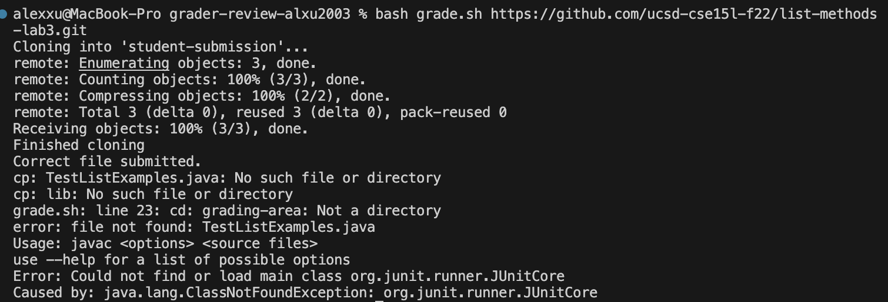
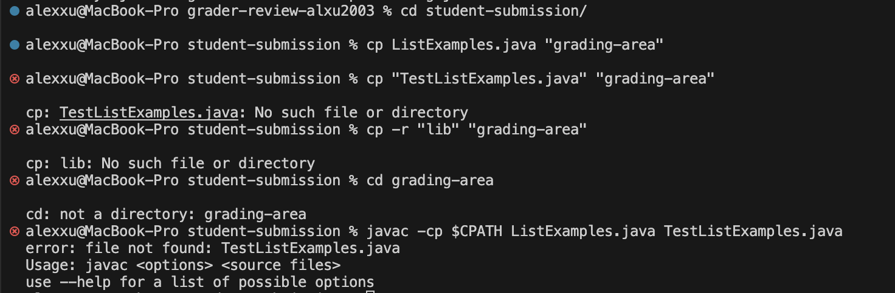
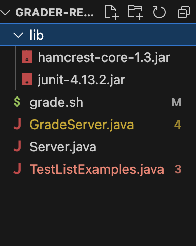

# Lab Report 5 - - Putting it all together (Week 9)
## Part 1: Debugging Scenario
For some reason I can't copy `TestListExamples.java` and `lib` into `grading-area` in my grading script, and subsequent commands also do not work.
 <br>
I'm guessing I have some misunderstanding of the cp command, because my cp commands can't find ListExamples.java or lib even though I can see them in the directory.<br>
TA Response: Do you remember how paths work in the terminal? Try going through the commands in your bash script manually one by one. <br>

Student Response: <br>
 <br>
So first, I type `cd student-submission` to get inside the directory. Then I copy the student's `ListExamples.java` into the grading area using `cp ListExamples.java "grading-area"`. That part has no bugs.
But then, when I type 
```
cp "TestListExamples.java" "grading-area"
cp -r "lib" "grading-area"
```
The terminal tells me those files don't exist. After thinking about it, it's because I'm still in the `student-submission` directory, and the `TestListExamples.java` file and `lib` directory are in the `grader-review-alxu2003` directory that contains 
the `student-submission` directory. So the specific line of code that causes these bugs is line 18, `cd student-submission/`, that messes up the paths to the other files 
besides `ListExamples.java` for subsequent commnds.
 <br>

The files needed for the setup is `grade.sh`, `GradeServer.java`, a JUnit library directory `lib`, `Server.java`, and `TestListExamples.java`. <br>
 <br>
(`lib` contains standard JUnit files that we've been using the whole quarter, so I hope I don't have to put those here because that would make this report extremely long)

Before fixing `grade.sh`:
```
CPATH='.:lib/hamcrest-core-1.3.jar:lib/junit-4.13.2.jar'


rm -rf student-submission
rm -rf grading-area

mkdir grading-area

git clone $1 student-submission
echo 'Finished cloning'

if [[ -f student-submission/ListExamples.java ]]
then echo "Correct file submitted."
else echo "Incorrect file! Submit a file named ListExamples.java."
    exit
fi

cd student-submission/
cp ListExamples.java "grading-area"
cp "TestListExamples.java" "grading-area"
cp -r "lib" "grading-area"

cd grading-area
javac -cp $CPATH ListExamples.java TestListExamples.java

java -cp $CPATH org.junit.runner.JUnitCore TestListExamples 1> errors.txt

cat "errors.txt"

grep "Tests run:" errors.txt > final_score.txt
if [[ -e $? ]]
then echo $? > errors.txt

exit
fi

# Draw a picture/take notes on the directory structure that's set up after
# getting to this point

# Then, add here code to compile and run, and do any post-processing of the
# tests


# Draw a picture/take notes on the directory structure that's set up after
# getting to this point

# Then, add here code to compile and run, and do any post-processing of the
# tests
```
Before fixing, `GradeServer.java`:
```
import java.io.BufferedReader;
import java.io.IOException;
import java.io.InputStream;
import java.io.InputStreamReader;
import java.net.URI;
import java.net.URISyntaxException;
import java.util.Arrays;
import java.util.stream.Stream;

class ExecHelpers {

  /**
    Takes an input stream, reads the full stream, and returns the result as a
    string.

    In Java 9 and later, new String(out.readAllBytes()) would be a better
    option, but using Java 8 for compatibility with ieng6.
  */
  static String streamToString(InputStream out) throws IOException {
    String result = "";
    while(true) {
      int c = out.read();
      if(c == -1) { break; }
      result += (char)c;
    }
    return result;
  }

  /**
    Takes a command, represented as an array of strings as it would by typed at
    the command line, runs it, and returns its combined stdout and stderr as a
    string.
  */
  static String exec(String[] cmd) throws IOException {
    Process p = new ProcessBuilder()
                    .command(Arrays.asList(cmd))
                    .redirectErrorStream(true)
                    .start();
    InputStream outputOfBash = p.getInputStream();
    return String.format("%s\n", streamToString(outputOfBash));
  }

}

class Handler implements URLHandler {
    public String handleRequest(URI url) throws IOException {
       if (url.getPath().equals("/grade")) {
           String[] parameters = url.getQuery().split("=");
           if (parameters[0].equals("repo")) {
               String[] cmd = {"bash", "grade.sh", parameters[1]};
               String result = ExecHelpers.exec(cmd);
               return result;
           }
           else {
               return "Couldn't find query parameter repo";
           }
       }
       else {
           return "Don't know how to handle that path!";
       }
    }
}

class GradeServer {
    public static void main(String[] args) throws IOException {
        if(args.length == 0){
            System.out.println("Missing port number! Try any number between 1024 to 49151");
            return;
        }

        int port = Integer.parseInt(args[0]);

        Server.start(port, new Handler());
    }
}

class ExecExamples {
  public static void main(String[] args) throws IOException {
    String[] cmd1 = {"ls", "lib"};
    System.out.println(ExecHelpers.exec(cmd1));

    String[] cmd2 = {"pwd"};
    System.out.println(ExecHelpers.exec(cmd2));

    String[] cmd3 = {"touch", "a-new-file.txt"};
    System.out.println(ExecHelpers.exec(cmd3));
  }
}
```
Before fixing, `Server.java`:
```
// A simple web server using Java's built-in HttpServer

// Examples from https://dzone.com/articles/simple-http-server-in-java were useful references

import java.io.IOException;
import java.io.OutputStream;
import java.net.InetSocketAddress;
import java.net.URI;

import com.sun.net.httpserver.HttpExchange;
import com.sun.net.httpserver.HttpHandler;
import com.sun.net.httpserver.HttpServer;

interface URLHandler {
    String handleRequest(URI url) throws IOException;
}

class ServerHttpHandler implements HttpHandler {
    URLHandler handler;
    ServerHttpHandler(URLHandler handler) {
      this.handler = handler;
    }
    public void handle(final HttpExchange exchange) throws IOException {
        // form return body after being handled by program
        try {
            String ret = handler.handleRequest(exchange.getRequestURI());
            // form the return string and write it on the browser
            exchange.sendResponseHeaders(200, ret.getBytes().length);
            OutputStream os = exchange.getResponseBody();
            os.write(ret.getBytes());
            os.close();
        } catch(Exception e) {
            String response = e.toString();
            exchange.sendResponseHeaders(500, response.getBytes().length);
            OutputStream os = exchange.getResponseBody();
            os.write(response.getBytes());
            os.close();
        }
    }
}

public class Server {
    public static void start(int port, URLHandler handler) throws IOException {
        HttpServer server = HttpServer.create(new InetSocketAddress(port), 0);

        //create request entrypoint
        server.createContext("/", new ServerHttpHandler(handler));

        //start the server
        server.start();
        System.out.println("Server Started! Visit http://localhost:" + port + " to visit.");
    }
}
```

Before fixing, `TestListExamples.java`
```
import static org.junit.Assert.*;
import org.junit.*;
import java.util.Arrays;
import java.util.List;

class IsMoon implements StringChecker {
  public boolean checkString(String s) {
    return s.equalsIgnoreCase("moon");
  }
}

public class TestListExamples {
  @Test(timeout = 500)
  public void testMergeRightEnd() {
    List<String> left = Arrays.asList("a", "b", "c");
    List<String> right = Arrays.asList("a", "d");
    List<String> merged = ListExamples.merge(left, right);
    List<String> expected = Arrays.asList("a", "a", "b", "c", "d");
    assertEquals(expected, merged);
  }

   @Test
  public void testFilter(){
    IsMoon test = new IsMoon();
    List<String> toFilter = Arrays.asList("moon", "MOON", "apple","moOn");
    List<String> filtered = ListExamples.filter(toFilter, test);
    List<String> ideal = Arrays.asList("moon", "MOON", "moOn");
    assertEquals(ideal, filtered);
  }
}
```
I ran `bash grade.sh` to trigger the bug. In order to fix it, I will add a `cd ..` on line 20 after `cp ListExamples.java "grading-area"`
on line 19. This will exit the `student-submissions` directory and make the rest of the commands run correctly.

## Part 2: Reflection
I learned a lot about jdb when practicing for the last skill demo which was cool since I didn't know I could do that at all. It was interesting using `step` and `step over` to 
watch my code run line by line.


